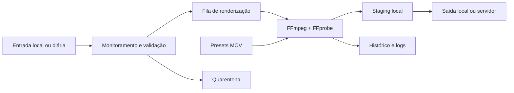

<p align="center">
  
</p>

<p align="center">
  <a href="https://www.python.org/"></a>
  
  
  <a href="https://github.com/raphaelalves-dev/autorender-studio/actions/workflows/tests.yml"></a>
  <a href="https://github.com/raphaelalves-dev/autorender-studio/releases/latest"></a>
  <a href="LICENSE.md"></a>
</p>

<p align="center">
  Automação desktop para monitorar entradas, validar mídias, aplicar presets e entregar vídeos renderizados com FFmpeg.
</p>

> Software proprietário da **Clicks da Serra**. Desenvolvido por **Raphael Alves**.

## Visão geral

O AutoRender Studio transforma uma estrutura de pastas em um fluxo de produção
automatizado. O aplicativo identifica lotes de vídeos, valida os arquivos com
FFprobe, aplica presets personalizados e organiza a entrega dos resultados sem
exigir operação manual a cada render.

A interface foi criada para uso contínuo em Windows, com monitoramento do
servidor em segundo plano, histórico, recuperação de falhas e opções de
aceleração por GPU.

## Download

A versão publicada está disponível em
[GitHub Releases](https://github.com/raphaelalves-dev/autorender-studio/releases/latest).

Cada release inclui:

- pacote ZIP de atualização para uma instalação existente;
- checksum SHA-256 para validação do download;
- código-fonte nos formatos `.zip` e `.tar.gz`;
- notas com mudanças e instruções da versão.

> O pacote de atualização não inclui presets, FFmpeg, vídeos ou configurações
> locais. Para uma instalação nova, siga o [início rápido](#início-rápido).

### Histórico e restauração

Na primeira abertura do executável com histórico, o aplicativo guarda uma cópia
dos seus próprios arquivos em `update/history/`. Antes de aplicar os próximos
ZIPs, salva novamente o executável e a pasta `_internal/` da versão instalada.
Cada registro contém data, versão e nome do pacote. O histórico fica na
instalação local e pode crescer a cada atualização.

Se uma atualização causar problemas, feche o AutoRender Studio e use
**Configurações > Voltar versão**. Se a janela não abrir, execute
`update/RESTAURAR_VERSAO_ANTERIOR.bat` na pasta da instalação. A restauração
substitui o executável e `_internal/`; preserva presets, FFmpeg, configuração,
vídeos e logs. Não apague `update/history/` enquanto precisar dessa opção.

## Arquitetura



## Casos de uso

- renderização automática de vídeos recebidos por pastas;
- composição de pares de câmeras 81 e 82;
- aplicação individual de preset em câmeras 81 a 86;
- processamento de lotes criados por ciclos automáticos ou manuais;
- entrega em servidor com staging local;
- estações Windows dedicadas à produção contínua.

## Recursos

### Automação

- monitoramento contínuo com `watchdog`;
- entrada e saída por pastas diárias configuráveis;
- prioridade para lotes `*_AUTO`, `*_MANUAL_TODAS`, `Manual` e `Manual_Retry`;
- inicialização com o Windows e execução automática opcionais;
- até dois renders simultâneos.

### Renderização

- composição com presets MOV;
- chroma key, escala, crop, posicionamento e fundo desfocado;
- seleção automática entre NVIDIA NVENC, AMD AMF e CPU `libx264`;
- limite de duração e parâmetros de áudio configuráveis;
- remoção de saídas parciais quando um render falha.

### Confiabilidade

- validação com FFprobe antes de iniciar o processamento;
- espera controlada por arquivos ainda em cópia;
- histórico salvo de forma atômica;
- retomada de itens cuja saída desapareceu;
- quarentena automática após tentativas inválidas;
- limpeza diária de processados e quarentena;
- rotação de logs com retenção limitada.

### Entrega e interface

- staging local antes da cópia para outro disco ou servidor;
- preservação da pasta de origem do ciclo;
- cartões independentes para entrada e destino;
- verificação do servidor em segundo plano;
- estado visual de disponibilidade sem bloquear a interface;
- geometria da janela preservada entre execuções.

## Formatos de renderização

| Formato | Comportamento |
|---|---|
| **1 vídeo (82)** | Renderiza somente a câmera 82 com o preset individual. |
| **2 vídeos (81+82)** | Combina o par 81/82 com o preset duplo. |
| **Ambos** | Gera a composição 81/82 e a saída individual da câmera 82. |
| **Todos (81 a 86)** | Renderiza individualmente todas as câmeras disponíveis no lote. |

Quando existe somente um arquivo `.mov` em `preset/`, o aplicativo seleciona
automaticamente o modo **Todos**. Com dois presets, os formatos de par continuam
disponíveis conforme a configuração.

## Estrutura do projeto

```text
AutoRenderStudio/
├── AutoRenderPreset_GUI.py       ponto de entrada da interface
├── backend/                      render, fila, validação e entrega
├── frontend/                     interface desktop
├── tests/                        testes automatizados
├── config/                       configuração local
├── bin/                          FFmpeg e FFprobe locais
├── preset/                       presets MOV locais
├── entrada/                      vídeos aguardando processamento
├── saida/                        vídeos concluídos
├── processados/                  originais processados
├── erros/                        itens com erro
├── quarentena/                   mídias inválidas
├── logs/                         histórico e diagnóstico
├── update/                       pacotes locais de atualização
├── AutoRenderPreset.spec         build PyInstaller
└── AutoRenderStudio_Setup.iss    instalador Inno Setup
```

## Requisitos

### Para executar

- Windows 10 ou Windows 11;
- Python 3.11 ou superior;
- `ffmpeg.exe` e `ffprobe.exe`;
- um ou dois presets de vídeo `.mov`.

### Para compilar

- dependências de `requirements.txt`;
- PyInstaller 6 ou superior;
- Inno Setup 6 ou 7 para gerar o instalador.

## Início rápido

Clone o repositório:

```powershell
git clone https://github.com/raphaelalves-dev/autorender-studio.git
cd autorender-studio
```

Prepare o ambiente:

```text
INSTALAR.bat
```

Adicione os arquivos locais que não fazem parte do GitHub:

```text
bin\ffmpeg.exe
bin\ffprobe.exe
preset\seu-preset.mov
```

Execute em modo de teste:

```text
TESTAR_SEM_HISTORICO.bat
```

Na versão portátil, a primeira execução cria `config/settings.json`. O instalador
fornece uma configuração inicial simples e preserva a configuração existente em
reinstalações. Esse arquivo permanece fora do Git.

## Gerar os executáveis

Versão portátil:

```text
BUILD_EXE_PORTABLE.bat
```

Resultado:

```text
dist\AutoRenderPreset\AutoRenderPreset.exe
```

Para gerar um novo instalador base da versão do código atual:

```text
BUILD_INSTALLER.bat
```

O script gera um único instalador com o programa, FFmpeg, FFprobe e uma configuração inicial simples. **O preset não é incluído**:

```text
output\AutoRenderStudio_Setup_1.2.8.exe
```

O instalador base 1.2.5 criado anteriormente permanece em `output/`. Para atualizar essa instalação sem reinstalar, use **apenas** `update/AutoRenderStudio_Update_1.2.8.zip` em **Configurações > Atualizações**. O ZIP contém o programa completo da versão 1.2.8, incluindo as mudanças das versões 1.2.6 e 1.2.7; não é necessário carregar os ZIPs intermediários.

O instalador não pede senha e não inclui arquivos de vídeo. Na primeira abertura, selecione o preset `.MOV` e ajuste as pastas em **Configurações**; o arquivo pode estar na pasta `preset` do programa ou em outro local acessível. O caminho escolhido permanece salvo nas próximas aberturas. Não há assinatura digital nesta compilação local.

Depois de instalado, abra o AutoRender Studio para criar a primeira entrada do histórico. Atualizações posteriores são carregadas na tela **Configurações > Atualização ZIP**. A instalação preserva uma configuração já existente e os vídeos de trabalho.

Para reinstalar por cima, feche o AutoRender e execute o instalador na mesma conta do Windows. Se a instalação anterior usou este instalador, o assistente recupera a pasta já usada. Se você usa uma cópia portátil, escolha manualmente a pasta onde está `AutoRenderPreset.exe`. O instalador não substitui `config/settings.json`, presets fornecidos pelo usuário nem as pastas de vídeos e logs. Caminhos externos de entrada, saída e preset permanecem configurados após a atualização.

Antes de uma distribuição, execute:

```text
CHECK_PROD.bat
```

## Testes

```powershell
python -m unittest discover -s tests -v
```

A suíte cobre seleção de lotes, formatos de render, recuperação, entrega,
quarentena, retenção de logs, subprocessos ocultos e integração com a janela do
Windows.

## Segurança e publicação

Não publique:

```text
config/settings.json
vídeos de entrada ou saída
presets proprietários
FFmpeg e outros binários
logs de produção
senhas de instalador
pacotes privados de atualização
```

O `.gitignore` do projeto protege esses itens. Consulte a
[política de segurança](SECURITY.md) antes de divulgar um pacote.

## Status do projeto

Versão atual do código: **1.2.8**

Última atualização: **7 de outubro de 2026**

Em **Configurações > Fotos**, ative as fotos e use **+ Adicionar ponto** para criar uma linha por segundo central. Por exemplo, pontos nos segundos `10` e `25` produzem imagens nos segundos `9, 10, 11, 24, 25, 26` de **cada vídeo original**. Cada linha mostra a prévia dos três segundos e pode ser removida. Todos os JPGs novos ficam diretamente na pasta `fotos`, ao lado do vídeo final. O nome de cada arquivo identifica render, câmera, gravação e segundo, por exemplo `render__85__85_camera__0009s.jpg`. Fotos antigas em subpastas não são movidas pela atualização. Uma gravação curta demais para um trio é ignorada e registrada no log. A geração de fotos acrescenta tempo ao processamento da fila.

Para gerar fotos da gravação inteira, deixe **uma única linha com o valor `0`** e mantenha a opção de fotos ativa. O programa gera um JPG por segundo do vídeo original, incluindo o segundo 0 e o último segundo parcial. Nesse modo, organiza as imagens em `fotos/81/`, `fotos/82/` etc.; arquivos sem identificador 81–86 vão para `fotos/SEM_ID/`. Os pontos normais continuam usando diretamente `fotos/`.

O projeto está funcional e em evolução. Teste novas builds em uma estação sem
dados de produção antes da distribuição.

## Documentação

- [Histórico de versões](CHANGELOG.md)
- [Releases](https://github.com/raphaelalves-dev/autorender-studio/releases)
- [Política de segurança](SECURITY.md)
- [Como contribuir](CONTRIBUTING.md)
- [Licença](LICENSE.md)

## Licença

Código-fonte proprietário da **Clicks da Serra**. Consulte [LICENSE.md](LICENSE.md).
